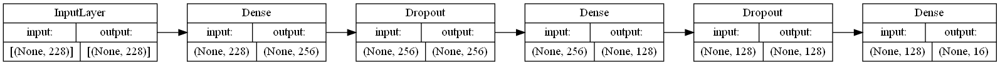

# Information and Recommendation Chatbot System

- [Information and Recommendation Chatbot System](#information-and-recommendation-chatbot-system)
- [Description](#description)
- [Dependencies](#dependencies)
- [Installation](#installation)
  - [Step 1. Clone the repository](#step-1-clone-the-repository)
  - [Step 2. Create a python virtual environment](#step-2-create-a-python-virtual-environment)
  - [Step 3. Activate the virtual environment](#step-3-activate-the-virtual-environment)
  - [Step 4. Install the dependencies](#step-4-install-the-dependencies)
  - [Step 5. Build the model](#step-5-build-the-model)
- [How to Run](#how-to-run)
- [License](#license)
- [Other Notes](#other-notes)
  - [Model](#model)
- [Contributors](#contributors)

# Description
This is a chatbot system that can provide information and course recommendation for the CADT institute.

This can be changed to fit other institutes or purpose.

# Dependencies
- Python 3.7+ (but I don't know if it will work, I have only tested it on 3.10.5)
- Tensorflow (don't worry, it will be installed automatically)
- A Telegram account and a Telegram bot token
- A Facebook Messenger page and its access tokens

After you've got all of these, check the .env.example file, copy and rename it to `.env` exactly, and fill in the values.

# Installation
## Step 1. Clone the repository
```bash
git clone https://T-Thyrak/irc-chatbot.git
```

## Step 2. Create a python virtual environment
```bash
python -m venv venv
```

## Step 3. Activate the virtual environment
```bash
source venv/bin/activate # this line for Linux
venv\Scripts\activate # this line for Windows
```

## Step 4. Install the dependencies
```bash
pip install -r requirements.txt
```

## Step 5. Build the model
```bash
python -m src.build_main # to build the main model
python -m src.build_yesno # to build the yes/no classifier
```
That's it, you are ready to run it!

# How to Run
Step 1. Activate the virtual environment. A common mistake I forget. Just like Step 3 in Installation.
```bash
source venv/bin/activate # this line for Linux
venv\Scripts\activate # this line for Windows
```

Step 2. Run the main.py file from the root of the project
```bash
python -m src.main
```

You can stop the program by pressing Ctrl+C.

# License
This project is licensed under the Apache License 2.0. See the [LICENSE](LICENSE) file for details.

If you can't read legalese, you can read it in [plain English here.](https://tldrlegal.com/license/apache-license-2.0-(apache-2.0))

# Other Notes
## Model
Main Chatbot Model



## Remote run script manager
I use `remote` to manage the run scripts specified in the `remote.toml` file.

Follow the instruction to get `remote` working [here](https://github.com/kuroyuki-kaze/remote).

# Contributors
- [T-Thyrak](https://github.com/T-Thyrak)